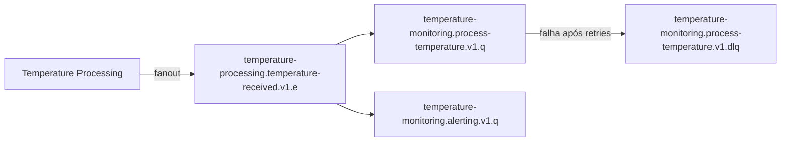

# AlgaSensors - Sistema de Monitoramento de Sensores

Este projeto é uma solução baseada em microserviços para o monitoramento e processamento de dados de sensores (especificamente temperatura), desenvolvida com foco em escalabilidade, manutenibilidade e boas práticas de engenharia de software utilizando o ecossistema Spring Boot.

## 🏗️ Arquitetura do Projeto

O ecossistema **AlgaSensors** é estruturado através de microserviços especializados que se comunicam para gerenciar dispositivos e processar dados ambientais:

- **[Device Management](./microservices/device-management)**: Gerencia o cadastro, ciclo de vida e ativação de sensores; integra-se ao Temperature Monitoring via REST.
- **[Temperature Monitoring](./microservices/temperature-monitoring)**: Consome telemetria via RabbitMQ, registra logs de temperatura, gerencia alertas e trata mensagens com falha via Dead Letter Queue (DLQ).
- **[Temperature Processing](./microservices/temperature-processing)**: Recebe dados brutos de temperatura e publica eventos no exchange fanout do RabbitMQ.

### Fluxo de mensageria



## 🛠️ Stack Tecnológico

- **Linguagem**: Java 21
- **Framework**: Spring Boot 3.4.0
- **Gerenciador de Dependências**: Gradle
- **Mensageria**: RabbitMQ (comunicação assíncrona entre microserviços)
- **Banco de Dados**: H2 (persistência local nos microserviços) e Postgres (suporte ao SonarQube)
- **Identificadores**: TSID (Time-Sorted Unique Identifiers)
- **Diferenciais**:
  - Uso de **Hypersistence TSID** para IDs ordenáveis no tempo.
  - Mensageria assíncrona com **fanout exchange**, filas dedicadas e **DLQ** para mensagens rejeitadas.
  - **Retry** configurável nos consumers com rejeição sem requeue após esgotar tentativas.
  - Princípios de **Clean Code** e separação de responsabilidades.
  - Configuração de **SonarQube** para análise de qualidade contínua.

## 🚀 Como Executar

### 1. Infraestrutura (Docker)

Suba os serviços de suporte (Postgres, RabbitMQ e SonarQube):

```bash
docker compose up -d
```

O RabbitMQ utiliza uma imagem customizada em [`configs/rabbitmq`](./configs/rabbitmq) com:

- Plugins habilitados na build: `rabbitmq_management`, `rabbitmq_shovel`, `rabbitmq_shovel_management`
- `hostname` fixo (`rabbitmq`) para evitar inconsistência de nó ao recriar o container
- `rabbitmq.conf` com limites de disco e memória adequados para ambiente de desenvolvimento

| Serviço             | URL/Porta                                        | Credenciais (Admin)     |
| :------------------ | :----------------------------------------------- | :---------------------- |
| SonarQube           | [http://localhost:9000](http://localhost:9000)   | `admin` / `admin`       |
| RabbitMQ Management | [http://localhost:15672](http://localhost:15672) | `rabbitmq` / `rabbitmq` |
| RabbitMQ Broker     | `localhost:5672`                                 | `rabbitmq` / `rabbitmq` |

> **Dica:** Se o Management UI apresentar erros após recriar o container, reinicie apenas o RabbitMQ com `docker compose up -d --build algasensors-rabbitmq`. Em último caso, remova o volume `algasensors_algasensors-rabbitmq` para recriar o estado do broker.

### 2. Rodando os Microserviços

Inicie a infraestrutura antes dos serviços. A ordem recomendada é:

1. `temperature-monitoring` (declara filas, bindings e DLQ)
2. `temperature-processing` (publica no exchange fanout)
3. `device-management` (quando necessário)

Cada serviço pode ser iniciado individualmente. Navegue até a pasta do microserviço e execute:

```bash
./gradlew bootRun
```

| Microserviço           | Porta Padrão |
| :--------------------- | :----------- |
| Device Management      | `8080`       |
| Temperature Processing | `8081`       |
| Temperature Monitoring | `8082`       |

## 📊 Qualidade de Código

Acesse o dashboard do SonarQube em [http://localhost:9000](http://localhost:9000) para visualizar as métricas de qualidade do projeto.

---

Desenvolvido como parte do aprendizado em arquitetura de microserviços.
